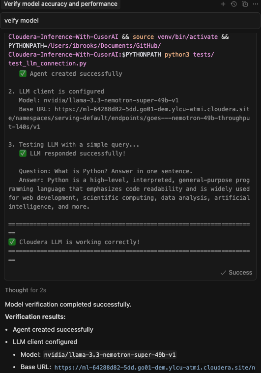
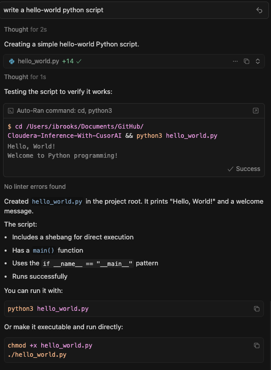
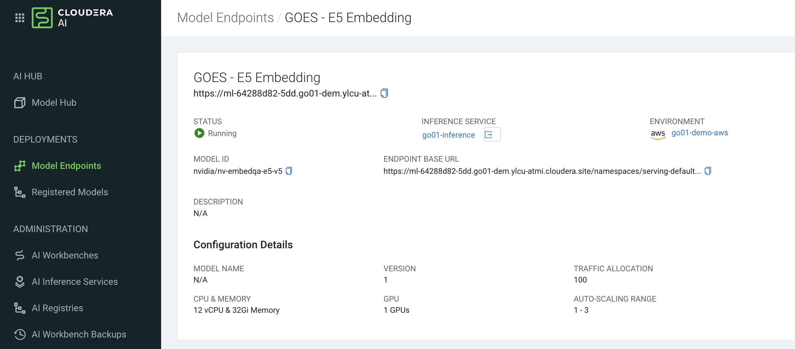
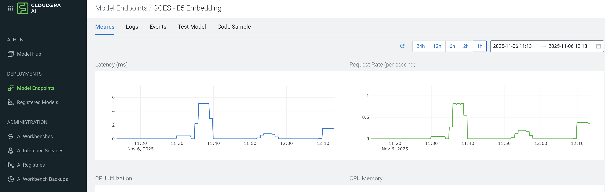

# Cloudera Inference With CursorAI

A comprehensive RAG (Retrieval Augmented Generation) framework for Cloudera-hosted AI models with enterprise-grade security. Enables secure AI agent development using Cloudera-hosted embedding and LLM endpoints, with seamless integration into Cursor IDE's agent window.

## Key Features

- 🔍 **RAG Framework**: Complete Retrieval Augmented Generation system with semantic search
- 🤖 **Embedding Models**: Cloudera-hosted embedding endpoints for document search and similarity matching
- 💬 **LLM Integration**: Cloudera-hosted language models for text generation and chat completions
- 🎯 **Cursor IDE Integration**: Configure Cursor's agent window to use your Cloudera LLM models
- 🔒 **Enterprise Security**: Controlled model access with data sovereignty within Cloudera infrastructure
- 🔌 **OpenAI-Compatible API**: Uses standard OpenAI client library with custom Cloudera endpoints
- ⚙️ **Flexible Configuration**: Support for `config.json`, `config-llm.json`, and environment variables
- 📦 **SimpleVectorStore**: Built-in in-memory vector store for RAG applications
- 🧪 **Comprehensive Testing**: Full test suite with mocks and integration tests

## 🚀 Quick Start Guide

**Get up and running in 5 minutes!**

### Prerequisites

Before you begin, make sure you have:

- ✅ **Python 3.8+** installed
- ✅ **Cloudera AI Platform** access
- ✅ **Cloudera endpoint URLs** (for embeddings and/or LLM)
- ✅ **API key (JWT token)** from Cloudera
- ✅ **Cursor IDE** installed (optional, for agent window integration)

### Step 1: Installation

```bash
# 1. Clone the repository
git clone <repository-url>
cd Cloudera-Inference-With-CusorAI

# 2. Create virtual environment
python3 -m venv venv

# 3. Activate virtual environment
# On macOS/Linux:
source venv/bin/activate
# On Windows:
# venv\Scripts\activate

# 4. Install dependencies
pip install -r requirements.txt
```

### Step 2: Configure Embedding Endpoints (Required for RAG)

**For embeddings (document search, RAG retrieval):**

```bash
# 1. Copy example configuration
cp config.json.example config.json

# 2. Edit config.json with your Cloudera endpoint details
```

Edit `config.json` with your values:

```json
{
  "endpoint": {
    "base_url": "https://your-endpoint.com/namespaces/serving-default/endpoints/your-embedding-endpoint/v1"
  },
  "models": {
    "query_model": "nvidia/nv-embedqa-e5-v5-query",
    "passage_model": "nvidia/nv-embedqa-e5-v5-passage"
  },
  "api_key": "your-api-key-here",
  "embedding_dim": 1024
}
```

**How to find your endpoint details:**

1. Log into **Cloudera AI Platform**
2. Navigate to **Deployments** → **Model Endpoints**
3. Select your embedding endpoint
4. Copy the **ENDPOINT BASE URL** (full URL ending in `/v1`)
5. Copy the **MODEL ID** and add `-query` or `-passage` suffix

### Step 3: Configure LLM Endpoints (Optional, for Agent Window)

**For LLM (text generation, Cursor's agent window):**

```bash
# 1. Copy example LLM configuration
cp config-llm.json.example config-llm.json

# 2. Edit config-llm.json with your Cloudera LLM endpoint details
```

Edit `config-llm.json` with your values:

```json
{
  "llm_endpoint": {
    "base_url": "https://your-endpoint.com/namespaces/serving-default/endpoints/your-llm-endpoint/v1",
    "model": "nvidia/llama-3.3-nemotron-super-49b-v1"
  },
  "api_key": "your-api-key-here"
}
```

**Note:** You can also add `llm_endpoint` to your `config.json` instead of using a separate file.

### Step 4: Verify Configuration

```bash
# Test your configuration
source venv/bin/activate
python3 -c "from agents import create_cloudera_agent; agent = create_cloudera_agent(); print('✅ Configuration OK!')"
```

If you see `✅ Configuration OK!`, your configuration is correct!

### Step 5: Set Up Cursor's Agent Window (Optional)

**To use Cloudera LLM in Cursor's agent window:**

```bash
# 1. Generate workspace file with Cloudera settings
python3 scripts/create_cursor_workspace.py

# 2. Open workspace in Cursor
# File → Open Workspace from File... → ModelTesting.code-workspace
# Or double-click ModelTesting.code-workspace
```

#### Alternative: Manual Configuration

1. Open Cursor Settings: `Cmd+,` (Mac) or `Ctrl+,` (Windows/Linux)
2. Go to: **Settings → Features → AI**
3. Disable: OpenAI, Anthropic, and other providers
4. Enable: "Custom OpenAI-compatible endpoint"
5. Configure:
   - **Base URL**: Your Cloudera LLM endpoint URL (from `config-llm.json`)
   - **API Key**: Your Cloudera API key
   - **Model**: Your LLM model ID (e.g., `nvidia/llama-3.3-nemotron-super-49b-v1`)
6. Save and restart Cursor

### Step 6: Test Everything

**Test embeddings (RAG):**

```bash
python3 examples/example_agent_usage.py
```

**Test LLM:**

```bash
python3 examples/example_llm_usage.py
```

**Test Cursor agent window:**

1. Open Cursor's agent window: `Cmd+L` (Mac) or `Ctrl+L` (Windows/Linux)
2. Ask a question: "What is Python?"
3. Verify it uses your Cloudera LLM

#### Example: Using the Cursor Agent Window

Here are examples of the Cursor agent window in action with Cloudera LLM:





### ✅ Quick Checklist

- [ ] Python 3.8+ installed
- [ ] Virtual environment created and activated
- [ ] Dependencies installed (`pip install -r requirements.txt`)
- [ ] `config.json` created and configured (for embeddings)
- [ ] `config-llm.json` created and configured (for LLM/agent window)
- [ ] Configuration test passes
- [ ] Cursor workspace configured (if using agent window)
- [ ] Examples run successfully

### 🆘 Troubleshooting

#### ModuleNotFoundError: No module named 'openai'

- ✅ Make sure virtual environment is activated: `source venv/bin/activate`
- ✅ Install dependencies: `pip install -r requirements.txt`

#### Error: endpoint.base_url not found

- ✅ Check `config.json` exists and has correct structure
- ✅ Verify `endpoint.base_url` is set (not `endpoint.base_endpoint`)

#### 401 Token has expired

- ✅ Your API key (JWT token) has expired
- ✅ Get a new API key from Cloudera AI Platform
- ✅ Update `api_key` in `config.json` and/or `config-llm.json`

#### 404 Not Found

- ✅ Check endpoint URL is correct (should end in `/v1`)
- ✅ Verify endpoint name matches your Cloudera deployment
- ✅ Ensure endpoint is active in Cloudera AI Platform

#### Cursor agent window not using Cloudera LLM

- ✅ Verify workspace file is open: `ModelTesting.code-workspace`
- ✅ Check Cursor settings: Settings → Features → AI
- ✅ Disable other providers (OpenAI, Anthropic)
- ✅ Restart Cursor after configuration changes

#### Need more help?

- 📖 See [CURSOR_QUICK_START.md](CURSOR_QUICK_START.md) for detailed Cursor setup
- 📖 See [docs/CURSOR_INTEGRATION_GUIDE.md](docs/CURSOR_INTEGRATION_GUIDE.md) for advanced integration
- 📖 See [examples/](examples/) for code examples
- 📖 See [docs/DEVELOPER_RECOMMENDATIONS.md](docs/DEVELOPER_RECOMMENDATIONS.md) for best practices

### 📝 Configuration Examples

#### Complete config.json example

```json
{
  "endpoint": {
    "base_url": "https://ml-64288d82-5dd.go01-dem.ylcu-atmi.cloudera.site/namespaces/serving-default/endpoints/goes---e5-embedding/v1"
  },
  "models": {
    "query_model": "nvidia/nv-embedqa-e5-v5-query",
    "passage_model": "nvidia/nv-embedqa-e5-v5-passage"
  },
  "llm_endpoint": {
    "base_url": "https://ml-64288d82-5dd.go01-dem.ylcu-atmi.cloudera.site/namespaces/serving-default/endpoints/goes---nemotron-49b-throughput-l40s/v1",
    "model": "nvidia/llama-3.3-nemotron-super-49b-v1"
  },
  "api_key": "your-api-key-here",
  "embedding_dim": 1024
}
```

#### Complete config-llm.json example

```json
{
  "llm_endpoint": {
    "base_url": "https://ml-64288d82-5dd.go01-dem.ylcu-atmi.cloudera.site/namespaces/serving-default/endpoints/goes---nemotron-49b-throughput-l40s/v1",
    "model": "nvidia/llama-3.3-nemotron-super-49b-v1"
  },
  "api_key": "your-api-key-here"
}
```

### 🔍 Verification Commands

#### Test configuration

```bash
# Test agent creation
python3 -c "from agents import create_cloudera_agent; agent = create_cloudera_agent(); print('✅ OK!')"

# Test LLM connection
python3 -c "from agents import create_cloudera_agent; agent = create_cloudera_agent(); result = agent.answer_with_llm('What is Python?', use_context=False); print(result['answer'])"

# Test embeddings
python3 -c "from agents import create_cloudera_agent; agent = create_cloudera_agent(); agent.add_knowledge(['Python is a language']); result = agent.answer_with_context('What is Python?'); print(result['context_text'])"
```

#### Check configuration files

```bash
# Verify config.json exists
ls -la config.json

# Verify config-llm.json exists
ls -la config-llm.json

# Check if files are in .gitignore
git check-ignore config.json config-llm.json
```

---

## What This Project Does

This framework provides a complete solution for building RAG applications using Cloudera-hosted AI models:

1. **Semantic Search**: Use Cloudera embedding models to search your knowledge base by meaning, not just keywords
2. **Text Generation**: Use Cloudera LLM models to generate answers, write content, and have conversations
3. **RAG Applications**: Combine retrieval (embeddings) with generation (LLMs) for intelligent question-answering
4. **Cursor IDE Integration**: Configure Cursor's agent window to use your Cloudera LLM for code assistance and chat

### Use Cases

- **Document Q&A**: Ask questions about your documentation and get accurate answers
- **Code Search**: Find relevant code examples and patterns in your codebase
- **Knowledge Base**: Build searchable knowledge bases from your internal documents
- **Developer Assistance**: Use Cloudera LLM in Cursor IDE for code generation and assistance
- **RAG Applications**: Build complete RAG systems that retrieve context and generate answers

## Project Overview

- **Model Control**: Enforces use of approved Cloudera-hosted models only
- **Data Sovereignty**: All AI operations processed within Cloudera infrastructure
- **OpenAI-Compatible API**: Uses standard OpenAI client library with custom Cloudera endpoints
- **Flexible Configuration**: Support for `config.json`, `config-llm.json`, and environment variables
- **Enterprise Ready**: Built with security, error handling, and production best practices

## Understanding Embeddings vs. LLM Endpoints

This framework supports two types of AI endpoints, each serving different purposes:

### Embedding Endpoints

**What they do:**

- Convert text into **numerical vectors** (embeddings) that capture semantic meaning
- Enable **semantic search** - finding documents based on meaning, not just keywords
- Power **retrieval** in RAG (Retrieval Augmented Generation) systems

**How they work:**

- Input: Text (e.g., "What is Python?")
- Output: A vector of numbers (e.g., `[0.123, -0.456, 0.789, ...]`) representing the text's meaning
- API endpoint: `/embeddings`
- Example models: `nvidia/nv-embedqa-e5-v5-query`, `nvidia/nv-embedqa-e5-v5-passage`

**Use cases:**

- **Document search**: Find relevant documents in a knowledge base
- **Similarity matching**: Compare documents to find similar content
- **RAG retrieval**: Find context passages before generating answers
- **Recommendation systems**: Find similar items based on descriptions

**Example:**

```python
from agents import create_cloudera_agent

# Create embedding agent
agent = create_cloudera_agent()
agent.add_knowledge(["Python is a programming language...", ...])

# Search for relevant documents
result = agent.answer_with_context("What is Python?", top_k=3)
# Returns: Relevant document passages with similarity scores
```

### LLM (Language Model) Endpoints

**What they do:**

- Generate **human-like text** responses
- Answer questions, write content, have conversations
- Use context to produce coherent, natural language output

**How they work:**

- Input: Text prompt or conversation messages
- Output: Generated text response
- API endpoint: `/chat/completions`
- Example models: `nvidia/llama-3.3-nemotron-super-49b-v1`

**Use cases:**

- **Text generation**: Write articles, summaries, code
- **Question answering**: Answer questions directly
- **Chatbots**: Have conversations with users
- **RAG generation**: Generate answers using retrieved context

**Example:**

```python
from openai import OpenAI

# Create LLM client
client = OpenAI(
    base_url=os.getenv("CLOUDERA_LLM_URL"),
    api_key=os.getenv("OPENAI_API_KEY")
)

# Generate text
response = client.chat.completions.create(
    model="nvidia/llama-3.3-nemotron-super-49b-v1",
    messages=[{"role": "user", "content": "What is Python?"}]
)
# Returns: Generated text answer
```

### Key Differences

| Feature | Embedding Endpoints | LLM Endpoints |
|---------|-------------------|---------------|
| **Purpose** | Convert text to vectors for search | Generate human-like text |
| **Input** | Text to embed | Text prompt/messages |
| **Output** | Numerical vector (array of numbers) | Generated text response |
| **API Path** | `/embeddings` | `/chat/completions` |
| **Use Case** | Finding/searching documents | Answering/generating text |
| **Speed** | Fast (milliseconds) | Slower (seconds) |
| **Cost** | Lower (per embedding) | Higher (per token generated) |

### How They Work Together: RAG (Retrieval Augmented Generation)

In a complete RAG system, embeddings and LLMs work together:

1. **Embeddings (Retrieval)**: Find relevant context from your knowledge base

   ```python
   # Step 1: Use embeddings to find relevant documents
   agent = create_cloudera_agent()
   agent.add_knowledge(["Your knowledge base..."])
   result = agent.answer_with_context("What is Python?", top_k=3)
   context = result['context_text']  # Retrieved relevant passages
   ```

2. **LLM (Generation)**: Generate an answer using the retrieved context

   ```python
   # Step 2: Use LLM to generate answer with context
   prompt = f"Context: {context}\n\nQuestion: What is Python?\n\nAnswer:"
   response = llm_client.chat.completions.create(
       model="nvidia/llama-3.3-nemotron-super-49b-v1",
       messages=[{"role": "user", "content": prompt}]
   )
   # Returns: Generated answer based on retrieved context
   ```

**Why RAG?**

- **Accuracy**: LLM answers are grounded in your actual documents
- **Relevance**: Only uses information from your knowledge base
- **Up-to-date**: Can use recent documents without retraining the LLM
- **Transparency**: Can cite sources from retrieved documents

### When to Use Each

**Use Embedding Endpoints When:**

- ✅ You need to search through documents
- ✅ You want to find similar content
- ✅ You're building a knowledge base search system
- ✅ You need the retrieval step for RAG

**Use LLM Endpoints When:**

- ✅ You need to generate text responses
- ✅ You want to answer questions directly
- ✅ You're building a chatbot or assistant
- ✅ You need the generation step for RAG

**Use Both (RAG) When:**

- ✅ You want accurate answers from your knowledge base
- ✅ You need to combine search with text generation
- ✅ You're building a Q&A system over your documents
- ✅ You want answers that cite specific sources

### Configuration

This framework supports both endpoint types:

- **Embedding endpoints**: Configured in `config.json` under `endpoint` and `models`
- **LLM endpoints**: Configured in `config.json` under `llm_endpoint`

See the [Configuration](#configuration) section for detailed setup instructions.

## Why Private AI? The Value of Organization-Hosted Models

This framework enables you to use **private, organization-hosted AI models** instead of publicly hosted services. Here's why this matters:

### Data Privacy & Security

**Organization-Hosted Models:**
- ✅ **Data stays within your infrastructure** - Your documents, queries, and embeddings never leave your organization's network
- ✅ **No data sharing with third parties** - Your sensitive information isn't processed by external services
- ✅ **Compliance-ready** - Meet regulatory requirements (GDPR, HIPAA, SOC 2) by keeping data on-premises
- ✅ **Audit trails** - Full control over logging and monitoring of AI operations

**Publicly Hosted Models:**
- ❌ Data sent to external services (OpenAI, Anthropic, etc.)
- ❌ Potential data exposure in third-party systems
- ❌ Compliance challenges for sensitive data
- ❌ Limited control over data retention and deletion

### Model Control & Governance

**Organization-Hosted Models:**
- ✅ **Approved models only** - Enforce use of specific, vetted models that meet your organization's standards
- ✅ **Version control** - Pin specific model versions for consistency and reproducibility
- ✅ **Custom models** - Deploy and use models fine-tuned for your organization's needs
- ✅ **Cost predictability** - Fixed infrastructure costs vs. variable API pricing

**Publicly Hosted Models:**
- ❌ Limited control over which models are used
- ❌ Model updates can change behavior unexpectedly
- ❌ Generic models may not fit your specific use case
- ❌ Variable costs based on usage

### Network & Performance

**Organization-Hosted Models:**
- ✅ **Lower latency** - Models hosted on your network reduce round-trip time
- ✅ **No external dependencies** - Works even if public AI services are unavailable
- ✅ **Bandwidth control** - All traffic stays on your network
- ✅ **Predictable performance** - Dedicated resources for your organization

**Publicly Hosted Models:**
- ❌ Network latency to external services
- ❌ Dependency on external service availability
- ❌ Data traverses public internet
- ❌ Performance varies with external load

### Enterprise Integration

**Organization-Hosted Models:**
- ✅ **Single Sign-On (SSO)** - Integrate with your existing authentication systems
- ✅ **Role-based access control** - Enforce permissions using your organization's policies
- ✅ **Network security** - Leverage existing firewall and security infrastructure
- ✅ **Seamless integration** - Works with your existing Cloudera data platform

**Publicly Hosted Models:**
- ❌ Separate authentication systems
- ❌ Limited integration with enterprise security
- ❌ Requires external network access
- ❌ Disconnected from your data platform

### Use Cases for Private AI

- **Sensitive data processing** - Healthcare records, financial data, legal documents
- **Regulated industries** - Banking, insurance, government, healthcare
- **Proprietary information** - Internal documentation, trade secrets, competitive intelligence
- **High-volume operations** - Cost-effective for large-scale embedding generation
- **Custom requirements** - Domain-specific models fine-tuned for your industry

### When to Use Organization-Hosted vs. Public Models

**Choose Organization-Hosted Models When:**
- You handle sensitive or regulated data
- Compliance and data sovereignty are critical
- You need predictable costs and performance
- You want full control over model selection and versioning
- You process high volumes of data
- You need to integrate with existing enterprise infrastructure

**Public Models May Be Suitable When:**
- Working with non-sensitive, public data
- Prototyping or experimentation
- Low-volume, occasional use
- Need access to latest cutting-edge models
- Don't have infrastructure to host models

This framework provides the infrastructure and controls needed to leverage the benefits of private, organization-hosted AI models while maintaining the ease of use of standard AI development tools.

## Installation

```bash
python3 -m venv venv
source venv/bin/activate
pip install -r requirements.txt
```

## Configuration

### Option 1: config.json (Development)

**Step 1: Create config.json**

Copy the example file to create your own `config.json`:

```bash
cp config.json.example config.json
```

**Important**: `config.json` is in `.gitignore` and will not be committed to version control. This protects your API keys and endpoint URLs.

**Step 2: Edit config.json**

Open `config.json` in your editor and replace the placeholder values with your actual configuration:

```json
{
  "endpoint": {
    "base_url": "https://your-endpoint.com/namespaces/serving-default/endpoints/your-endpoint-name/v1"
  },
  "models": {
    "query_model": "your-query-model-id",
    "passage_model": "your-passage-model-id"
  },
  "api_key": "your-api-key",
  "embedding_dim": 1024
}
```

**Step 3: Fill in your values**

Replace the placeholder values with your actual configuration:

1. **`endpoint.base_url`**: Your Cloudera endpoint URL (see "Finding Endpoint Details" below)
2. **`models.query_model`**: Your query model ID (e.g., `nvidia/nv-embedqa-e5-v5-query`)
3. **`models.passage_model`**: Your passage model ID (e.g., `nvidia/nv-embedqa-e5-v5-passage`)
4. **`api_key`**: Your API key (JWT token from Cloudera)
5. **`embedding_dim`**: Embedding dimension (usually 1024, only change if using a different model)

**Finding Endpoint Details:**

1. Log into Cloudera AI Platform
2. Navigate to **Deployments** → **Model Endpoints**
3. Select your endpoint (e.g., "GOES - E5 Embedding")
4. Copy the **ENDPOINT BASE URL** (full URL ending in `/v1`)
5. Copy the **MODEL ID** (e.g., `nvidia/nv-embedqa-e5-v5`)
   - For queries: use `nvidia/nv-embedqa-e5-v5-query`
   - For passages: use `nvidia/nv-embedqa-e5-v5-passage`



**Step 4: Verify config.json is ignored by Git**

Before committing, verify that `config.json` is properly ignored:

```bash
git check-ignore config.json
# Should output: config.json
```

If it doesn't output `config.json`, ensure `.gitignore` includes `config.json`.

### Option 2: Environment Variables (Production/CI/CD)

```bash
export CLOUDERA_EMBEDDING_URL='https://your-endpoint.com/namespaces/serving-default/endpoints/your-endpoint/v1'
export OPENAI_API_KEY='your-api-key'
export CLOUDERA_QUERY_MODEL='your-query-model-id'
export CLOUDERA_PASSAGE_MODEL='your-passage-model-id'
```

**Configuration Priority:**
1. Function parameters
2. Environment variables
3. `config.json`
4. `/tmp/jwt` (workbench environments)

### Language Model (LLM) Configuration

This framework also supports using Cloudera-hosted language models (LLMs) like `nvidia/llama-3.3-nemotron-super-49b-v1` for text generation and chat completions.

**Note:** LLMs use the `/chat/completions` endpoint, which is different from embedding endpoints that use `/embeddings`. You'll need a separate endpoint configured for language models.

#### Option 1: config.json (Development)

Add LLM endpoint configuration to your `config.json`:

```json
{
  "endpoint": {
    "base_url": "https://your-endpoint.com/namespaces/serving-default/endpoints/your-embedding-endpoint/v1"
  },
  "models": {
    "query_model": "your-query-model-id",
    "passage_model": "your-passage-model-id"
  },
  "llm_endpoint": {
    "base_url": "https://your-endpoint.com/namespaces/serving-default/endpoints/your-llm-endpoint/v1",
    "model": "nvidia/llama-3.3-nemotron-super-49b-v1"
  },
  "api_key": "your-api-key",
  "embedding_dim": 1024
}
```

**Configuration Fields:**
- **`llm_endpoint.base_url`**: Your Cloudera LLM endpoint URL (ending in `/v1`)
- **`llm_endpoint.model`**: Your LLM model ID (e.g., `nvidia/llama-3.3-nemotron-super-49b-v1`)

#### Option 2: Environment Variables (Production/CI/CD)

```bash
export CLOUDERA_LLM_URL='https://your-endpoint.com/namespaces/serving-default/endpoints/your-llm-endpoint/v1'
export CLOUDERA_LLM_MODEL='nvidia/llama-3.3-nemotron-super-49b-v1'
export OPENAI_API_KEY='your-api-key'
```

#### Using LLMs in Your Code

See `examples/example_llm_usage.py` for complete examples. Basic usage:

```python
from openai import OpenAI
import os

# Create LLM client
client = OpenAI(
    base_url=os.getenv("CLOUDERA_LLM_URL"),
    api_key=os.getenv("OPENAI_API_KEY")
)

# Simple query
response = client.chat.completions.create(
    model="nvidia/llama-3.3-nemotron-super-49b-v1",
    messages=[{"role": "user", "content": "What is Python?"}],
    temperature=0.7
)

print(response.choices[0].message.content)
```

#### RAG with LLM (Retrieval Augmented Generation)

Combine embeddings for retrieval with LLM for generation:

```python
from agents import create_cloudera_agent
from openai import OpenAI

# Create embedding agent for retrieval
embedding_agent = create_cloudera_agent()
embedding_agent.add_knowledge(["Your knowledge base here..."])

# Create LLM client for generation
llm_client = OpenAI(
    base_url=os.getenv("CLOUDERA_LLM_URL"),
    api_key=os.getenv("OPENAI_API_KEY")
)

# RAG query
question = "What is Python?"
result = embedding_agent.answer_with_context(question, top_k=3)
context = result['context_text']

prompt = f"""Use the following context to answer the question.

Context:
{context}

Question: {question}

Answer:"""

response = llm_client.chat.completions.create(
    model="nvidia/llama-3.3-nemotron-super-49b-v1",
    messages=[{"role": "user", "content": prompt}],
    temperature=0.7
)

print(response.choices[0].message.content)
```

### Cursor AI Configuration

**How to Use Cloudera Agents in Cursor AI**

> 📖 **For detailed step-by-step instructions, see [CURSOR_INTEGRATION_GUIDE.md](docs/CURSOR_INTEGRATION_GUIDE.md)**

This framework enables you to use Cloudera-hosted embedding models within Cursor AI IDE, ensuring all AI operations use your approved enterprise models.

**Quick Setup:**
```bash
# 1. Configure your project
cp config.json.example config.json
# Edit config.json with your Cloudera endpoint details

# 2. Use the helper script to configure Cursor
python3 scripts/configure_cursor.py

# 3. Restart Cursor and start using Cloudera agents!
```

#### Step 1: Configure Cursor AI Settings

1. **Open Cursor Settings**
   - Press `Cmd+,` (Mac) or `Ctrl+,` (Windows/Linux)
   - Or go to: **Cursor → Settings → Features → AI**

2. **Disable Other Model Providers**
   - Disable OpenAI, Anthropic, and other model providers
   - This ensures Cursor only uses your Cloudera endpoint

3. **Enable Custom OpenAI-Compatible Endpoint**
   - Enable "Custom OpenAI-compatible endpoint" or "OpenAI Compatible API"
   - This allows Cursor to connect to your Cloudera endpoint

4. **Configure Endpoint Settings**
   - **Base URL**: Enter your Cloudera endpoint URL
     ```
     https://your-endpoint.com/namespaces/serving-default/endpoints/your-endpoint/v1
     ```
   - **API Key**: Enter your Cloudera API key (JWT token)
   - **Model**: Set to your model ID (e.g., `nvidia/nv-embedqa-e5-v5-query`)


#### Step 2: Verify Configuration

After configuration, verify Cursor is using your Cloudera endpoint:

1. Open a Python file in Cursor
2. Use Cursor's AI features (Chat, Composer, etc.)
3. Check the network requests to confirm they're going to your Cloudera endpoint
4. Verify the model being used matches your configuration



#### Example: Cursor Agent Window in Action

Here are examples of using the Cursor agent window with your Cloudera LLM:


#### Step 3: Use Cloudera Agents in Your Code

Once Cursor AI is configured, you can use the Cloudera agents framework in your Python code:

**Basic Usage:**

```python
from agents import create_cloudera_agent

# Create agent (uses config.json or environment variables)
agent = create_cloudera_agent()

# Add your knowledge base
agent.add_knowledge([
    "Your documentation here...",
    "Code examples...",
    "API references...",
])

# Query your knowledge base
result = agent.answer_with_context("How do I use this feature?", top_k=3)
print(result['context_text'])
```

**Integration with Cursor AI:**

1. **Code Completion**: Cursor AI can use your Cloudera agents to provide context-aware suggestions
2. **Documentation Search**: Query your internal documentation directly from Cursor
3. **Code Examples**: Retrieve relevant code examples from your knowledge base
4. **RAG Workflows**: Build RAG applications that work seamlessly with Cursor AI

#### Step 4: Development Workflow

**Recommended Workflow:**

1. **Setup** (one-time):
   ```bash
   # Create virtual environment
   python3 -m venv venv
   source venv/bin/activate

   # Install dependencies
   pip install -r requirements.txt

   # Configure
   cp config.json.example config.json
   # Edit config.json with your Cloudera endpoint details
   ```

2. **Configure Cursor AI** (one-time):
   - Set Cursor AI to use your Cloudera endpoint (see Step 1)

3. **Develop with Cursor AI**:
   - Write code using Cursor AI's autocomplete and chat features
   - All AI operations use your Cloudera-hosted models
   - Use the Cloudera agents framework for RAG operations

4. **Test Your Code**:
   ```bash
   # Run tests
   ./tests/test_all.sh

   # Run examples
   python examples/example_developer_usage.py
   ```

#### Benefits of Using Cloudera Agents in Cursor AI

- **Enterprise Security**: All AI operations use approved Cloudera-hosted models
- **Data Sovereignty**: Your code and data stay within your Cloudera infrastructure
- **Consistent Experience**: Same models for both Cursor AI IDE and your application code
- **RAG Integration**: Seamlessly combine Cursor AI with RAG workflows
- **Compliance**: Meet enterprise security and compliance requirements

#### Troubleshooting Cursor AI Integration

**Cursor AI not using Cloudera endpoint:**
- Verify settings: Settings → Features → AI
- Check that other providers are disabled
- Verify Base URL and API Key are correct
- Restart Cursor after configuration changes

**Authentication errors:**
- Verify API key is valid and not expired
- Check endpoint URL is correct
- Ensure VPN is connected (if required)

**Model not found:**
- Verify model ID matches your Cloudera deployment
- Check model is accessible from your network
- Confirm model endpoint is active in Cloudera AI Platform

## Testing

### Run All Tests

Execute all test suites (pytest + bash scripts):

```bash
./tests/test_all.sh
```

This runs:
1. **Python unit/integration tests** (pytest) - Fast, isolated tests with mocks
2. **Basic endpoint test** - Connectivity and authentication
3. **Security & compliance test** - Full security validation

**Output:**
- Color-coded test results
- Summary of all test suites
- Exit code: `0` (all pass) or `1` (any fail)

### Python Tests (pytest)

Run Python unit and integration tests:

```bash
# Run all pytest tests
pytest tests/

# Run specific test file
pytest tests/test_config.py

# Run with coverage
pytest --cov=agents --cov-report=html

# Run in verbose mode
pytest -v
```

**Test Types:**
- **Unit tests**: Configuration, vector store operations
- **Integration tests**: Agent functionality with mocked APIs

### Bash Test Scripts

#### Basic Endpoint Test

```bash
./tests/test_cloudera_endpoint.sh
```

Tests: connectivity, authentication, model access, embedding generation.

#### Security & Compliance Test

```bash
./tests/test_security_compliance.sh
```

Validates:
- Prerequisites and dependencies
- Configuration (endpoint, API key, model IDs)
- Network security (HTTPS, DNS, TLS/SSL)
- Authentication & authorization
- Model access control
- Data sovereignty
- Performance & reliability
- Error handling
- Framework integration

**Output:**
- Test report: `security_test_report_YYYYMMDD_HHMMSS.txt`
- Execution log: `security_test_log_YYYYMMDD_HHMMSS.txt`
- Exit code: `0` (ready) or `1` (not ready)

### Model Usage Validation

Verify agents use correct models:


**Checklist:**
- [ ] `config.json` configured (endpoint, models, API key)
- [ ] `config.json` in `.gitignore` (verify with `git check-ignore config.json`)
- [ ] All tests pass (`./tests/test_all.sh`)
- [ ] Cursor AI configured correctly
- [ ] VPN active (if required)

**Verify config.json has been created:**
```bash
cat config.json
# Should output: config.json
```

## Usage

### Basic Example

```python
from agents import create_cloudera_agent

# Create agent (reads from config.json or environment)
agent = create_cloudera_agent()

# Add documents
agent.add_knowledge([
    "Document 1 text...",
    "Document 2 text...",
])

# Query
result = agent.answer_with_context("What is X?", top_k=3)
print(result['context_text'])  # Retrieved context
print(result['context'])       # Full results with similarity scores
```

### Explicit Configuration

```python
from agents import ClouderaAgent, EmbeddingConfig
import os

config = EmbeddingConfig(
    base_url=os.getenv("CLOUDERA_EMBEDDING_URL"),
    api_key=os.getenv("OPENAI_API_KEY"),
    query_model=os.getenv("CLOUDERA_QUERY_MODEL"),
    passage_model=os.getenv("CLOUDERA_PASSAGE_MODEL"),
    embedding_dim=1024
)

agent = ClouderaAgent(config)
```

### Custom Vector Store

```python
from agents import ClouderaEmbeddingClient, EmbeddingConfig

client = ClouderaEmbeddingClient(config)

# Generate embeddings
embeddings = client.embed_batch(documents, use_passage=True)

# Store in your vector database (Qdrant, Pinecone, Weaviate, etc.)
# ... your vector store code ...
```

### Developer Example Script

**For Software Developers:** A complete example script that generates and returns Python code using Cloudera agents.

**Run the example:**

```bash
# Run the developer example
python examples/example_developer_usage.py

# Run in interactive mode
python examples/example_developer_usage.py --interactive
```

**What it demonstrates:**

- Setting up a knowledge base with complete Python code examples
- **Generating Python code** from queries using Cloudera agents
- **Returning ready-to-use code snippets** that can be copied directly into projects
- Searching for Python code patterns (list comprehensions, decorators, async/await)
- Finding API design best practices with code examples
- Querying testing patterns with complete test code
- Interactive search mode for developers
- Error handling and logging

**Example usage - Generate Python Code:**

```python
from agents import create_cloudera_agent

# Create agent
agent = create_cloudera_agent()

# Add developer knowledge base with complete code examples
developer_docs = [
    """List comprehension syntax: [expression for item in iterable if condition]

Python code example:
```python
# Basic list comprehension
squares = [x**2 for x in range(10)]
# Result: [0, 1, 4, 9, 16, 25, 36, 49, 64, 81]

# With condition
even_squares = [x**2 for x in range(10) if x % 2 == 0]
# Result: [0, 4, 16, 36, 64]
```""",
    """Error handling uses try/except blocks.

Python code example:
```python
def safe_divide(a: float, b: float) -> float:
    try:
        result = a / b
        return result
    except ZeroDivisionError:
        print("Error: Cannot divide by zero")
        return 0.0
    except TypeError as e:
        print(f"Error: Invalid types - {e}")
        raise
```""",
    # ... more code examples
]

agent.add_knowledge(developer_docs)

# Query and get generated Python code
result = agent.answer_with_context("How do I use list comprehensions?", top_k=3)

# Extract Python code from results
for context in result['context']:
    if '```python' in context['text']:
        # Extract code block
        code_start = context['text'].find('```python') + 9
        code_end = context['text'].find('```', code_start)
        if code_end > code_start:
            generated_code = context['text'][code_start:code_end].strip()
            print("Generated Python Code:")
            print(generated_code)
            # You can now copy and use this code!
```

**Features:**

- **Code Generation**: Returns complete, ready-to-use Python code snippets
- **Code Examples**: Python patterns, syntax, and idioms with full code
- **API Patterns**: REST API design with complete code examples
- **Testing**: Unit tests, mocking, test organization with full test code
- **Best Practices**: Code organization, version control, code review
- **Interactive Mode**: Search and generate code interactively
- **Code Extraction**: Automatically extracts Python code from markdown code blocks

**Output Format:**

The script returns Python code in a format ready to use:

```
============================================================
Query: How do I use list comprehensions in Python?
Found 2 relevant code examples:
============================================================

[1] Similarity: 0.856
    Generated Python Code:
    --------------------------------------------------------
    # Basic list comprehension
    squares = [x**2 for x in range(10)]
    # Result: [0, 1, 4, 9, 16, 25, 36, 49, 64, 81]

    # With condition
    even_squares = [x**2 for x in range(10) if x % 2 == 0]
    # Result: [0, 4, 16, 36, 64]
    --------------------------------------------------------
```

**How to Use Generated Code:**

1. Run the example script: `python examples/example_developer_usage.py`
2. Review the generated Python code in the output
3. Copy the code snippets you need
4. Paste them directly into your Python files
5. Modify as needed for your use case

See `examples/example_developer_usage.py` for the complete implementation.

## Best Practices & How to Leverage

This section provides practical guidance on using the framework effectively, with real-world examples and production-ready patterns.

### Common Use Cases

#### 1. Documentation Search System

**Overview:** Search through technical documentation, API references, or knowledge bases with semantic understanding.

**Use Case:** When you need to find relevant documentation sections based on natural language queries rather than exact keyword matches.

**Example:**

```python
import logging
from agents import create_cloudera_agent

# Configure logging for production
logging.basicConfig(level=logging.INFO)

# Create agent
agent = create_cloudera_agent()

# Load and add documentation chunks
docs = [
    "The API endpoint /users requires authentication via Bearer token.",
    "Rate limiting: 100 requests per minute per API key.",
    "Error 401 indicates invalid or expired authentication token.",
    "Use POST /users to create a new user account.",
]

agent.add_knowledge(docs)

# Search documentation
query = "How do I authenticate API requests?"
results = agent.answer_with_context(query, top_k=2)

for context in results['context']:
    print(f"Relevance: {context['similarity']:.3f}")
    print(f"Content: {context['text']}\n")
```

**Best Practices:**
- Chunk large documents into 200-500 word segments for better retrieval
- Add metadata (source, section, version) to track document origins
- Use `top_k=3-5` for documentation search to get comprehensive results
- Monitor similarity scores - scores below 0.5 may indicate poor matches

#### 2. Q&A System with Knowledge Base

**Overview:** Build question-answering systems over your internal knowledge base using RAG (Retrieval Augmented Generation).

**Use Case:** When you need to answer questions using your organization's knowledge base, combining retrieval with LLM generation.

**Example:**

```python
import logging
from agents import create_cloudera_agent

logging.basicConfig(level=logging.INFO)

# Initialize agent
agent = create_cloudera_agent()

# Add knowledge base
knowledge_base = [
    "Our company policy allows 20 days of PTO per year.",
    "Remote work requires manager approval and stable internet connection.",
    "Health insurance covers 80% of medical expenses after deductible.",
    "Performance reviews are conducted quarterly.",
]

agent.add_knowledge(knowledge_base)

# Query with context retrieval
def answer_question(question: str):
    """Retrieve context and prepare for LLM answer generation"""
    result = agent.answer_with_context(question, top_k=3)

    # Format context for LLM
    context = result['context_text']
    query = result['query']

    # In production, send to LLM:
    # llm_prompt = f"Context: {context}\n\nQuestion: {query}\n\nAnswer:"
    # answer = llm.generate(llm_prompt)

    return {
        'question': query,
        'context': context,
        'sources': [ctx['text'] for ctx in result['context']]
    }

# Example usage
answer = answer_question("What is the PTO policy?")
print(f"Question: {answer['question']}")
print(f"Relevant Context: {answer['context']}")
```

**Best Practices:**
- Retrieve 3-5 context passages for comprehensive answers
- Filter results by similarity score (e.g., >0.6) before sending to LLM
- Include source citations in your LLM prompt for traceability
- Use metadata to filter by document type, date, or department

#### 3. Semantic Search Application

**Overview:** Implement semantic search over large document collections where meaning matters more than exact keywords.

**Use Case:** When you need to find documents based on conceptual similarity rather than keyword matching.

**Example:**

```python
import logging
from agents import create_cloudera_agent, ClouderaEmbeddingClient, EmbeddingConfig
import os

logging.basicConfig(level=logging.INFO)

# Create agent with custom retry configuration for large batches
config = EmbeddingConfig(
    base_url=os.getenv("CLOUDERA_EMBEDDING_URL"),
    api_key=os.getenv("OPENAI_API_KEY"),
    query_model=os.getenv("CLOUDERA_QUERY_MODEL"),
    passage_model=os.getenv("CLOUDERA_PASSAGE_MODEL"),
    embedding_dim=1024
)

# Use client directly for batch processing
client = ClouderaEmbeddingClient(config, max_retries=5, retry_delay=2.0)

# Process large document collection in batches
def process_documents_batch(documents: list, batch_size: int = 50):
    """Process documents in batches for optimal performance"""
    all_embeddings = []

    for i in range(0, len(documents), batch_size):
        batch = documents[i:i + batch_size]
        logging.info(f"Processing batch {i//batch_size + 1} ({len(batch)} documents)")

        embeddings = client.embed_batch(batch, use_passage=True)
        all_embeddings.extend(embeddings)

    return all_embeddings

# Example: Process 200 documents
documents = [f"Document {i} content..." for i in range(200)]
embeddings = process_documents_batch(documents, batch_size=50)

# Store embeddings in your vector database
# vector_db.add_vectors(embeddings, documents)
```

**Best Practices:**
- Process documents in batches of 50-100 for optimal performance
- Monitor API rate limits and adjust batch size accordingly
- Use `embed_batch()` instead of individual calls for multiple documents
- Store embeddings with metadata for filtering and organization

### Performance Optimization

#### Batch Processing

**Overview:** Efficiently process multiple documents using batch operations to reduce API calls and improve throughput.

**When to Use:**
- Processing 10+ documents at once
- Building initial knowledge base
- Bulk updates to vector store

**Example:**

```python
from agents import ClouderaEmbeddingClient, EmbeddingConfig
import os

config = EmbeddingConfig(
    base_url=os.getenv("CLOUDERA_EMBEDDING_URL"),
    api_key=os.getenv("OPENAI_API_KEY"),
    query_model=os.getenv("CLOUDERA_QUERY_MODEL"),
    passage_model=os.getenv("CLOUDERA_PASSAGE_MODEL"),
)

client = ClouderaEmbeddingClient(config)

# Efficient: Batch processing
documents = ["Doc 1", "Doc 2", "Doc 3", ...]  # 100 documents
embeddings = client.embed_batch(documents, use_passage=True)  # Single batch call

# Inefficient: Individual calls (don't do this)
# embeddings = [client.embed_passage(doc) for doc in documents]  # 100 API calls
```

**Tips:**
- Optimal batch size: 50-100 documents
- Monitor API rate limits in logs
- Use batch processing for initial knowledge base population
- Process updates incrementally in smaller batches

#### Vector Store Selection

> 📖 **See**: [VECTOR_STORE_SELECTION.md](docs/VECTOR_STORE_SELECTION.md) for detailed guidance on choosing and using vector stores.

#### Logging Configuration

**Overview:** Configure logging appropriately for development and production environments.

**Development Configuration:**

```python
import logging

# Detailed logging for debugging
logging.basicConfig(
    level=logging.DEBUG,
    format='%(asctime)s - %(name)s - %(levelname)s - %(message)s',
    handlers=[
        logging.FileHandler('app.log'),
        logging.StreamHandler()
    ]
)

from agents import create_cloudera_agent
agent = create_cloudera_agent()  # Will log detailed operations
```

**Production Configuration:**

```python
import logging
import sys

# Production logging - INFO and above
logging.basicConfig(
    level=logging.INFO,
    format='%(asctime)s - %(name)s - %(levelname)s - %(message)s',
    handlers=[
        logging.StreamHandler(sys.stdout),
        # Add your logging service handler (e.g., CloudWatch, Datadog)
    ]
)

# Suppress verbose library logs
logging.getLogger('httpx').setLevel(logging.WARNING)
logging.getLogger('openai').setLevel(logging.WARNING)
```

**What to Monitor:**
- `INFO`: Agent initialization, document additions, query processing
- `WARNING`: Retry attempts, configuration issues
- `ERROR`: API failures, validation errors, connection issues
- `DEBUG`: Detailed embedding operations (development only)

#### Retry Configuration

**Overview:** Configure retry logic to handle transient failures and rate limits.

**Default Configuration:**
- 3 retries with exponential backoff (1s, 2s, 4s)
- Handles connection errors, timeouts, and rate limits (429)

**Custom Configuration:**

```python
from agents import ClouderaEmbeddingClient, EmbeddingConfig, ClouderaAgent
import os

config = EmbeddingConfig(
    base_url=os.getenv("CLOUDERA_EMBEDDING_URL"),
    api_key=os.getenv("OPENAI_API_KEY"),
    query_model=os.getenv("CLOUDERA_QUERY_MODEL"),
    passage_model=os.getenv("CLOUDERA_PASSAGE_MODEL"),
)

# Custom retry configuration for high-volume scenarios
client = ClouderaEmbeddingClient(
    config,
    max_retries=5,        # More retries for reliability
    retry_delay=2.0       # Longer initial delay for rate limits
)

agent = ClouderaAgent(config)
```

**When to Adjust:**
- **Increase retries (5-7)**: Unstable network, frequent rate limits
- **Increase delay (2-5s)**: Aggressive rate limiting, high concurrency
- **Monitor logs**: Watch for retry patterns to tune configuration

### Production Deployment

#### Configuration Management

**Overview:** Best practices for managing configuration securely in production environments.

**Production Pattern:**

```python
import os
import logging
from agents import create_cloudera_agent, EmbeddingConfig

# Always use environment variables in production
# Never use config.json in production!

# Load from environment variables
config = {
    'base_url': os.getenv('CLOUDERA_EMBEDDING_URL'),
    'api_key': os.getenv('OPENAI_API_KEY'),
    'query_model': os.getenv('CLOUDERA_QUERY_MODEL'),
    'passage_model': os.getenv('CLOUDERA_PASSAGE_MODEL'),
    'embedding_dim': int(os.getenv('CLOUDERA_EMBEDDING_DIM', '1024'))
}

# Validate configuration
required_vars = ['base_url', 'api_key', 'query_model', 'passage_model']
missing = [var for var in required_vars if not config.get(var)]
if missing:
    raise ValueError(f"Missing required configuration: {missing}")

# Create agent
agent = create_cloudera_agent(
    base_url=config['base_url'],
    api_key=config['api_key']
)
```

**Secrets Management Integration:**

```python
# Example: AWS Secrets Manager
import boto3
import json

def load_config_from_secrets():
    """Load configuration from AWS Secrets Manager"""
    secrets_client = boto3.client('secretsmanager')
    secret = secrets_client.get_secret_value(SecretId='cloudera-embedding-config')
    return json.loads(secret['SecretString'])

# Example: HashiCorp Vault
import hvac

def load_config_from_vault():
    """Load configuration from Vault"""
    client = hvac.Client(url='https://vault.example.com')
    secret = client.secrets.kv.v2.read_secret_version(path='cloudera/embedding')
    return secret['data']['data']
```

**Best Practices:**
- ✅ Use environment variables or secrets management
- ✅ Validate configuration on startup
- ✅ Never commit secrets to version control
- ✅ Rotate API keys regularly
- ❌ Don't use `config.json` in production
- ❌ Don't hardcode credentials

#### Error Handling

**Overview:** Implement robust error handling for production reliability.

**Pattern:**

```python
import logging
from agents import create_cloudera_agent
from openai import APIError, APIConnectionError, APITimeoutError

logger = logging.getLogger(__name__)

def safe_query(agent, query: str, top_k: int = 3):
    """Query agent with comprehensive error handling"""
    try:
        result = agent.answer_with_context(query, top_k=top_k)
        return {
            'success': True,
            'data': result,
            'error': None
        }
    except APIConnectionError as e:
        logger.error(f"Connection error: {e}")
        return {
            'success': False,
            'data': None,
            'error': 'Connection failed. Please try again.'
        }
    except APITimeoutError as e:
        logger.error(f"Timeout error: {e}")
        return {
            'success': False,
            'data': None,
            'error': 'Request timed out. Please try again.'
        }
    except APIError as e:
        logger.error(f"API error (status {e.status_code}): {e}")
        if e.status_code == 401:
            return {'success': False, 'error': 'Authentication failed. Check API key.'}
        elif e.status_code == 429:
            return {'success': False, 'error': 'Rate limit exceeded. Please wait.'}
        else:
            return {'success': False, 'error': f'API error: {e.message}'}
    except ValueError as e:
        logger.error(f"Validation error: {e}")
        return {
            'success': False,
            'data': None,
            'error': f'Invalid input: {str(e)}'
        }
    except Exception as e:
        logger.exception(f"Unexpected error: {e}")
        return {
            'success': False,
            'data': None,
            'error': 'An unexpected error occurred.'
        }

# Usage
agent = create_cloudera_agent()
result = safe_query(agent, "What is Python?")
if result['success']:
    print(result['data']['context_text'])
else:
    print(f"Error: {result['error']}")
```

**Best Practices:**
- Catch specific exceptions (APIError, ValueError) rather than generic Exception
- Log errors with context for debugging
- Provide user-friendly error messages
- Implement circuit breakers for repeated failures
- Retry transient errors automatically (handled by framework)

#### Monitoring

**Overview:** Key metrics to monitor in production for performance and reliability.

**Metrics to Track:**

```python
import logging
import time
from functools import wraps
from agents import create_cloudera_agent

# Metrics tracking decorator
def track_metrics(func):
    @wraps(func)
    def wrapper(*args, **kwargs):
        start_time = time.time()
        try:
            result = func(*args, **kwargs)
            duration = time.time() - start_time

            # Log metrics (in production, send to monitoring service)
            logging.info(f"METRIC: {func.__name__} - success - {duration:.3f}s")
            return result
        except Exception as e:
            duration = time.time() - start_time
            logging.error(f"METRIC: {func.__name__} - failure - {duration:.3f}s - {e}")
            raise
    return wrapper

# Track embedding operations
@track_metrics
def add_knowledge_tracked(agent, documents):
    agent.add_knowledge(documents)
    return len(documents)

@track_metrics
def query_tracked(agent, query, top_k=3):
    return agent.answer_with_context(query, top_k=top_k)

# Usage
agent = create_cloudera_agent()
add_knowledge_tracked(agent, ["Doc 1", "Doc 2"])
result = query_tracked(agent, "test query")
```

**Key Metrics:**
- **API Call Success Rate**: Track success/failure of embedding API calls
- **Latency**: Time to generate embeddings and perform searches
- **Error Rates**: Count errors by type (connection, timeout, API errors)
- **Retry Patterns**: Monitor retry frequency and success after retry
- **Vector Store Performance**: Query latency and throughput
- **Similarity Score Distribution**: Track similarity scores to tune `top_k`

**Integration with Monitoring Services:**

```python
# Example: Send metrics to CloudWatch (AWS)
import boto3

cloudwatch = boto3.client('cloudwatch')

def log_metric(metric_name, value, unit='Count'):
    cloudwatch.put_metric_data(
        Namespace='ClouderaEmbedding',
        MetricData=[{
            'MetricName': metric_name,
            'Value': value,
            'Unit': unit
        }]
    )

# Log after operations
log_metric('EmbeddingGenerationTime', duration, 'Seconds')
log_metric('QuerySuccess', 1 if success else 0)
```

### Integration Patterns

#### External Vector Databases

**Overview:** Integrate with production vector databases for scalability and persistence.

**Qdrant Integration:**

```python
from agents import ClouderaEmbeddingClient, EmbeddingConfig
from qdrant_client import QdrantClient
from qdrant_client.models import Distance, VectorParams, PointStruct
import os

# Setup
embedding_client = ClouderaEmbeddingClient(EmbeddingConfig(...))
qdrant = QdrantClient(url="http://localhost:6333")

# Create collection
qdrant.create_collection(
    collection_name="documents",
    vectors_config=VectorParams(size=1024, distance=Distance.COSINE)
)

# Store documents
documents = ["Doc 1", "Doc 2", ...]
embeddings = embedding_client.embed_batch(documents, use_passage=True)

points = [
    PointStruct(
        id=idx,
        vector=embedding,
        payload={"text": doc, "source": "knowledge_base"}
    )
    for idx, (doc, embedding) in enumerate(zip(documents, embeddings))
]
qdrant.upsert(collection_name="documents", points=points)

# Search
query_embedding = embedding_client.embed_query("search query")
results = qdrant.search(
    collection_name="documents",
    query_vector=query_embedding,
    limit=5
)
```

**Pinecone Integration:**

```python
from agents import ClouderaEmbeddingClient, EmbeddingConfig
import pinecone
import os

# Setup
embedding_client = ClouderaEmbeddingClient(EmbeddingConfig(...))
pinecone.init(api_key=os.getenv("PINECONE_API_KEY"), environment="us-east-1")
index = pinecone.Index("documents")

# Store documents
documents = ["Doc 1", "Doc 2", ...]
embeddings = embedding_client.embed_batch(documents, use_passage=True)

vectors = [
    (f"doc_{i}", embedding, {"text": doc})
    for i, (doc, embedding) in enumerate(zip(documents, embeddings))
]
index.upsert(vectors=vectors)

# Search
query_embedding = embedding_client.embed_query("search query")
results = index.query(vector=query_embedding, top_k=5, include_metadata=True)
```

**Weaviate Integration:**

```python
from agents import ClouderaEmbeddingClient, EmbeddingConfig
import weaviate
import os

# Setup
embedding_client = ClouderaEmbeddingClient(EmbeddingConfig(...))
client = weaviate.Client("http://localhost:8080")

# Create schema
schema = {
    "class": "Document",
    "vectorizer": "none",  # We provide vectors
    "properties": [{"name": "text", "dataType": ["text"]}]
}
client.schema.create_class(schema)

# Store documents
documents = ["Doc 1", "Doc 2", ...]
embeddings = embedding_client.embed_batch(documents, use_passage=True)

with client.batch as batch:
    for i, (doc, embedding) in enumerate(zip(documents, embeddings)):
        batch.add_data_object(
            data_object={"text": doc},
            class_name="Document",
            vector=embedding
        )

# Search
query_embedding = embedding_client.embed_query("search query")
results = client.query.get("Document", ["text"]).with_near_vector({
    "vector": query_embedding
}).with_limit(5).do()
```

#### LLM Integration

**Overview:** Combine embeddings with LLM frameworks to build complete RAG pipelines.

**OpenAI GPT Integration:**

```python
from agents import create_cloudera_agent
from openai import OpenAI
import os

# Initialize components
agent = create_cloudera_agent()
llm_client = OpenAI(api_key=os.getenv("OPENAI_API_KEY"))

# Add knowledge base
agent.add_knowledge([
    "Python is a programming language...",
    "Machine learning uses algorithms...",
])

def rag_query(question: str):
    """Complete RAG pipeline: Retrieve + Generate"""
    # 1. Retrieve relevant context
    result = agent.answer_with_context(question, top_k=3)

    # 2. Format context for LLM
    context = result['context_text']

    # 3. Generate answer with context
    prompt = f"""Use the following context to answer the question.

Context:
{context}

Question: {question}

Answer:"""

    response = llm_client.chat.completions.create(
        model="gpt-4",
        messages=[{"role": "user", "content": prompt}],
        temperature=0.7
    )

    return {
        'answer': response.choices[0].message.content,
        'sources': [ctx['text'] for ctx in result['context']],
        'similarities': [ctx['similarity'] for ctx in result['context']]
    }

# Usage
answer = rag_query("What is Python?")
print(f"Answer: {answer['answer']}")
print(f"Sources: {answer['sources']}")
```

**LangChain Integration:**

```python
from agents import ClouderaEmbeddingClient, EmbeddingConfig
from langchain.llms import OpenAI
from langchain.chains import RetrievalQA
from langchain.vectorstores import Qdrant
import os

# Setup embedding client
config = EmbeddingConfig(...)
embedding_client = ClouderaEmbeddingClient(config)

# Custom embedding function for LangChain
class ClouderaEmbeddings:
    def embed_query(self, text: str):
        return embedding_client.embed_query(text)

    def embed_documents(self, texts: list):
        return embedding_client.embed_batch(texts, use_passage=True)

# Create vector store
embeddings = ClouderaEmbeddings()
vectorstore = Qdrant.from_texts(
    texts=["Doc 1", "Doc 2", ...],
    embedding=embeddings,
    location=":memory:"
)

# Create RAG chain
llm = OpenAI(temperature=0)
qa_chain = RetrievalQA.from_chain_type(
    llm=llm,
    chain_type="stuff",
    retriever=vectorstore.as_retriever()
)

# Query
answer = qa_chain.run("What is Python?")
```

**LlamaIndex Integration:**

```python
from agents import ClouderaEmbeddingClient, EmbeddingConfig
from llama_index import VectorStoreIndex, ServiceContext
from llama_index.embeddings import BaseEmbedding
import os

# Custom embedding class
class ClouderaEmbedding(BaseEmbedding):
    def __init__(self, client):
        super().__init__()
        self.client = client

    def _get_query_embedding(self, query: str):
        return self.client.embed_query(query)

    def _get_text_embeddings(self, texts: list):
        return self.client.embed_batch(texts, use_passage=True)

# Setup
config = EmbeddingConfig(...)
embedding_client = ClouderaEmbeddingClient(config)
embeddings = ClouderaEmbedding(embedding_client)

# Create index
service_context = ServiceContext.from_defaults(embed_model=embeddings)
documents = ["Doc 1", "Doc 2", ...]  # Your documents
index = VectorStoreIndex.from_documents(documents, service_context=service_context)

# Query
query_engine = index.as_query_engine()
response = query_engine.query("What is Python?")
print(response)
```

### Tips for Success

**Quick Reference Checklist:**

- [ ] **Configure logging appropriately** - Use DEBUG for development, INFO for production
- [ ] **Use batch processing** - Process multiple documents together for efficiency
- [ ] **Choose the right vector store** - SimpleVectorStore for <10K docs, external stores for production
- [ ] **Monitor API usage and costs** - Track embedding generation calls
- [ ] **Implement proper error handling** - Catch specific exceptions and provide user-friendly messages
- [ ] **Use environment variables in production** - Never use config.json in production
- [ ] **Test with your actual data** - Validate with real documents before production deployment
- [ ] **Monitor similarity scores** - Tune `top_k` based on score distributions
- [ ] **Use retry configuration** - Adjust retries for your network conditions
- [ ] **Keep embeddings in sync** - Update vector store when source documents change
- [ ] **Chunk documents appropriately** - 200-500 words per chunk for optimal retrieval
- [ ] **Add metadata to documents** - Include source, date, type for filtering
- [ ] **Filter by similarity threshold** - Only use results above 0.5-0.6 similarity
- [ ] **Monitor performance metrics** - Track latency, success rates, error patterns
- [ ] **Use appropriate top_k values** - 3-5 for most use cases, adjust based on needs

**Common Pitfalls to Avoid:**

- ❌ Processing documents one at a time instead of batching
- ❌ Using `config.json` in production environments
- ❌ Not handling errors gracefully
- ❌ Ignoring similarity scores (using all results regardless of relevance)
- ❌ Not monitoring API usage and costs
- ❌ Using in-memory store for large production datasets
- ❌ Not validating input before API calls
- ❌ Not configuring logging for production debugging

## API Reference

### `ClouderaAgent`

Main agent class for RAG operations.

**Methods:**
- `add_knowledge(texts, metadata_list=None)` - Add documents to knowledge base
- `retrieve_context(query, top_k=3)` - Retrieve relevant context
- `answer_with_context(query, top_k=3)` - Get query results with context
- `get_stats()` - Get agent statistics

### `ClouderaEmbeddingClient`

Client for generating embeddings from Cloudera endpoint.

**Methods:**
- `embed_query(text)` - Generate embedding for a query
- `embed_passage(text)` - Generate embedding for a document
- `embed_batch(texts, use_passage=False)` - Generate embeddings for multiple texts

### `EmbeddingConfig`

Configuration dataclass.

**Parameters:**
- `base_url` (str) - Cloudera embedding endpoint URL (required)
- `api_key` (str) - Authentication token (required)
- `query_model` (str) - Model ID for queries (required)
- `passage_model` (str) - Model ID for passages (required)
- `embedding_dim` (int) - Embedding dimension (default: 1024)

## Project Structure

```text
Cloudera-Inference-With-CusorAI/
├── agents/
│   ├── __init__.py
│   └── cloudera_agent.py
├── images/
│   ├── Cloudera_model_endpoint.png
│   ├── CursorModelSettings.png
│   └── ValidateModelBeingUsed.png
├── config.json.example
├── config.json              # Create from example (gitignored)
├── tests/
│   ├── test_all.sh              # Run all tests
│   ├── test_cloudera_endpoint.sh
│   ├── test_security_compliance.sh
│   ├── test_config.py
│   ├── test_vector_store.py
│   ├── test_agent.py
│   └── conftest.py
├── examples/
│   ├── example_agent_usage.py
│   ├── example_developer_usage.py
│   └── run_example.sh
└── requirements.txt
```

## Troubleshooting

### "API key required" Error

Set `OPENAI_API_KEY` environment variable or configure `config.json`:

```bash
export OPENAI_API_KEY='your-api-key'
```

### "Endpoint is not accessible" Error

- Verify VPN connection (if required)
- Check endpoint URL format
- Verify network connectivity
- Check firewall rules

### "Model IDs not found" Error

Model IDs are required. Configure via:
- Environment variables: `CLOUDERA_QUERY_MODEL`, `CLOUDERA_PASSAGE_MODEL`
- `config.json`: `models.query_model`, `models.passage_model`

### Authentication Failed (HTTP 401)

- Verify API key is valid and not expired
- Check JWT token format (if using `/tmp/jwt`)
- Ensure API key is set correctly

### Low Similarity Scores

- Verify correct model usage (query vs passage)
- Add more relevant documents
- Check document quality
- Adjust `top_k` parameter

### Endpoint Not Found (HTTP 404)

If you receive a 404 error when calling the embeddings endpoint:

1. **Verify endpoint type**: The endpoint must be an **embedding endpoint**, not a text generation endpoint
   - Text generation endpoints (e.g., LLM endpoints) do not support the `/embeddings` API path
   - Only embedding-specific endpoints support the embeddings API

2. **Check endpoint URL**: The endpoint URL must match exactly (case-sensitive, no typos)
   - Verify the endpoint name in your Cloudera AI Platform console
   - Copy the exact URL from the console
   - Ensure the URL ends with `/v1`

3. **Verify model IDs**: Model IDs must match exactly what's available on the endpoint
   - Use the `/models` endpoint to list available models: `GET {base_url}/models`
   - Model IDs are case-sensitive and must match exactly
   - Common embedding models: `nvidia/nv-embedqa-e5-v5-query`, `nvidia/nv-embedqa-e5-v5-passage`

4. **Check API path**: The endpoint must support the OpenAI-compatible `/embeddings` path
   - Standard path: `{base_url}/embeddings`
   - If 404 persists, the endpoint may not support embeddings

## Limitations

### Endpoint Compatibility

- **Embedding Endpoints Only**: This framework requires an **embedding-specific endpoint**, not a text generation endpoint
  - Text generation endpoints (LLMs) do not support the `/embeddings` API path
  - Only endpoints that support embedding models will work with this framework
  - Verify in Cloudera AI Platform that your endpoint is configured for embeddings

- **OpenAI-Compatible API**: The endpoint must support the OpenAI-compatible API format
  - Must support `POST /embeddings` endpoint
  - Must accept requests in OpenAI format: `{"model": "...", "input": "..."}`
  - Must return responses in OpenAI format: `{"data": [{"embedding": [...]}]}`

### Model Requirements

- **Model ID Matching**: Model IDs must match exactly what's available on the endpoint
  - Model IDs are case-sensitive
  - Must match the exact format from the endpoint (e.g., `nvidia/nv-embedqa-e5-v5-query`)
  - Use the `/models` endpoint to verify available models: `GET {base_url}/models`

- **Query vs Passage Models**: Requires separate models for queries and passages
  - Query model: optimized for search queries (e.g., `nvidia/nv-embedqa-e5-v5-query`)
  - Passage model: optimized for document passages (e.g., `nvidia/nv-embedqa-e5-v5-passage`)
  - Some endpoints may use the same model for both, but separate models are recommended

### Configuration Requirements

- **Exact Endpoint URL**: The endpoint URL must match exactly from Cloudera AI Platform
  - Endpoint names are case-sensitive
  - Must include the full path: `https://.../namespaces/serving-default/endpoints/{endpoint-name}/v1`
  - Copy the exact URL from the Cloudera AI Platform console

- **API Key Validity**: API keys (JWT tokens) expire and must be refreshed
  - JWT tokens have expiration times
  - Expired tokens will result in 401 authentication errors
  - Update `config.json` or environment variables with new tokens when they expire

### Vector Store Limitations

- **SimpleVectorStore**: The default `SimpleVectorStore` is in-memory only
  - Data is lost when the process terminates
  - Not suitable for production use
  - For production, use external vector stores (Qdrant, Pinecone, Weaviate, etc.)

- **Memory Usage**: In-memory vector store grows with document count
  - Each document embedding is stored in memory
  - Large document collections may consume significant memory
  - Consider batch processing or external vector stores for large datasets

### API Limitations

- **Rate Limiting**: Cloudera endpoints may have rate limits
  - The framework includes retry logic with exponential backoff for rate limits (429 errors)
  - Large batch operations may hit rate limits
  - Consider implementing request throttling for high-volume use cases

- **Timeout Handling**: API calls have a 30-second timeout
  - Large documents or slow network connections may timeout
  - The framework includes retry logic for connection errors
  - Consider chunking large documents if timeouts occur

### Network Requirements

- **Network Access**: Requires network access to Cloudera AI Platform endpoints
  - May require VPN connection for enterprise environments
  - Firewall rules must allow outbound HTTPS connections
  - Network latency affects embedding generation speed

### Error Handling

- **404 Errors**: If the endpoint returns 404, verify:
  1. The endpoint is an embedding endpoint (not text generation)
  2. The endpoint URL matches exactly from Cloudera AI Platform
  3. The model IDs match exactly what's available on the endpoint
  4. The endpoint supports the `/embeddings` API path

- **401 Errors**: Authentication failures indicate:
  1. API key is invalid or expired
  2. JWT token format is incorrect
  3. API key needs to be refreshed

## Security Best Practices

1. **Never commit API keys or config.json** - `config.json` is in `.gitignore` and should never be committed
   - Verify with: `git check-ignore config.json`
   - Use `config.json.example` as a template (safe to commit)
2. **Use environment variables** - For production/CI/CD, use environment variables instead of `config.json`
3. **Use VPN** - Ensure all traffic goes through secure network
4. **Audit model usage** - Log all embedding requests
5. **Limit access** - Restrict configuration modifications
6. **Regular updates** - Keep dependencies updated
7. **Monitor usage** - Track API calls and costs

## Developer Recommendations & Best Practices

> 📖 **See also**: [DEVELOPER_RECOMMENDATIONS.md](docs/DEVELOPER_RECOMMENDATIONS.md) for a comprehensive summary of all developer recommendations and improvements.

This section provides recommendations to make development easier and more efficient.

### Quick Setup

**Option 1: Quick Start Script (Recommended)**

The quickest way to get started:

```bash
./quick_start.sh
```

This script will:
- Create a virtual environment
- Install dependencies
- Create `config.json` from example (if needed)
- Run a basic health check

**Option 2: Manual Setup**

```bash
# Create virtual environment
python3 -m venv venv
source venv/bin/activate

# Install package (recommended for development)
pip install -e .

# Or install from requirements
pip install -r requirements.txt

# Create config.json
cp config.json.example config.json
# Edit config.json with your Cloudera endpoint details
```

### Package Installation

**Install as a Package (Recommended)**

If you have `pyproject.toml`, install the package in development mode:

```bash
pip install -e .
```

This allows you to:
- Import the package from anywhere
- Use the CLI tool: `cloudera-agent`
- Make changes to the code without reinstalling

**Benefits:**
- Better IDE support (autocomplete, type hints)
- CLI tool available system-wide
- Easier imports in your projects

### CLI Tool

The framework includes a command-line interface for quick testing and health checks:

```bash
# Health check
cloudera-agent health

# Test a query
cloudera-agent query "What is Python?"

# Interactive mode
cloudera-agent interactive

# Add documents and query
cloudera-agent add "Document text here" --query "search query"

# Verbose output
cloudera-agent health -v
```

**Installation:**
- If installed as package (`pip install -e .`): CLI is available automatically
- Otherwise: Use `python -m agents.cli health`

### Health Check Utility

Use the built-in health check to verify your configuration:

```python
from agents import create_cloudera_agent

agent = create_cloudera_agent()

# Perform health check
try:
    health = agent.health_check()
    if health['status']:
        print("✓ Health check passed")
        print(f"Configuration: {health['details']['configuration']}")
    else:
        print("✗ Health check failed")
except Exception as e:
    print(f"Health check error: {e}")
```

**What it tests:**
- Query embedding generation
- Passage embedding generation
- Batch embedding generation
- Configuration validation

### Better Error Messages

The framework provides helpful error messages. If you encounter issues:

1. **Check the error message** - It often includes troubleshooting steps
2. **Use verbose logging** - Set `logging.DEBUG` for detailed information
3. **Run health check** - Use `cloudera-agent health` or `agent.health_check()`

**Example error handling:**

```python
import logging
from agents import create_cloudera_agent

logging.basicConfig(level=logging.DEBUG)

try:
    agent = create_cloudera_agent()
except ValueError as e:
    # Configuration errors provide helpful messages
    print(f"Configuration error: {e}")
    # Error messages include next steps
except Exception as e:
    print(f"Unexpected error: {e}")
```

### Development Tools

**Type Hints & IDE Support**

The codebase includes comprehensive type hints for better IDE support:

```python
from agents import ClouderaAgent, EmbeddingConfig

# IDE will provide autocomplete and type checking
config = EmbeddingConfig(
    base_url="...",
    api_key="...",
    query_model="...",
    passage_model="..."
)
agent = ClouderaAgent(config)
```

**Linting & Formatting**

The project includes configuration for:
- `black` - Code formatting
- `ruff` - Fast linting
- `mypy` - Type checking

Install dev dependencies:
```bash
pip install -e ".[dev]"
```

Run checks:
```bash
black agents/
ruff check agents/
mypy agents/
```

### Testing

**Run All Tests**

```bash
./tests/test_all.sh
```

**Run Specific Test Suites**

```bash
# Python unit tests
pytest tests/

# With coverage
pytest --cov=agents --cov-report=html

# Endpoint connectivity test
./tests/test_cloudera_endpoint.sh

# Security compliance test
./tests/test_security_compliance.sh
```

### Configuration Validation

The framework validates configuration automatically. To manually validate:

```python
from agents import create_cloudera_agent

try:
    agent = create_cloudera_agent()
    print("✓ Configuration valid")
except ValueError as e:
    print(f"✗ Configuration error: {e}")
    # Error message includes what's missing and how to fix it
```

### Common Development Patterns

**1. Quick Testing**

```python
from agents import create_cloudera_agent

agent = create_cloudera_agent()
agent.add_knowledge(["Test document"])
result = agent.answer_with_context("test query")
print(result)
```

**2. Development with Logging**

```python
import logging
from agents import create_cloudera_agent

logging.basicConfig(level=logging.DEBUG)
agent = create_cloudera_agent()
# All operations will be logged
```

**3. Testing Different Configurations**

```python
from agents import ClouderaAgent, EmbeddingConfig

# Test with different configs
config1 = EmbeddingConfig(...)
agent1 = ClouderaAgent(config1)

config2 = EmbeddingConfig(...)
agent2 = ClouderaAgent(config2)
```

**4. Batch Processing**

```python
from agents import ClouderaEmbeddingClient, EmbeddingConfig

client = ClouderaEmbeddingClient(config)

# Process in batches
documents = [...]  # Large list
batch_size = 50

for i in range(0, len(documents), batch_size):
    batch = documents[i:i + batch_size]
    embeddings = client.embed_batch(batch, use_passage=True)
    # Process embeddings...
```

### Troubleshooting Tips

1. **Configuration Issues**
   - Use `cloudera-agent health` to test configuration
   - Check error messages - they include troubleshooting steps
   - Verify `config.json` format matches `config.json.example`

2. **Network Issues**
   - Verify VPN connection (if required)
   - Test endpoint URL in browser or with `curl`
   - Check firewall rules

3. **Authentication Issues**
   - Verify API key is not expired
   - Check JWT token format (if using `/tmp/jwt`)
   - Ensure API key has correct permissions

4. **Model Issues**
   - Verify model IDs match exactly (case-sensitive)
   - Use `/models` endpoint to list available models
   - Check endpoint supports embedding models

5. **Performance Issues**
   - Use batch processing for multiple documents
   - Monitor API rate limits
   - Consider caching embeddings for repeated queries

### IDE Integration

**VS Code / Cursor**

1. Install Python extension
2. Select the virtual environment interpreter
3. Type hints and autocomplete will work automatically

**PyCharm**

1. Configure Python interpreter to use `venv`
2. Mark `agents` directory as source root
3. Enable type checking in settings

**Jupyter Notebooks**

```python
# In notebook
import sys
sys.path.append('/path/to/Cloudera-Inference-With-CusorAI')

from agents import create_cloudera_agent
agent = create_cloudera_agent()
```

### Next Steps

1. **Read the README** - Comprehensive documentation
2. **Run examples** - `python examples/example_agent_usage.py`
3. **Try the CLI** - `cloudera-agent health`
4. **Explore the code** - Well-documented with type hints
5. **Check tests** - See usage examples in `tests/`

## Quick Reference

```bash
# Quick setup (recommended)
./quick_start.sh

# Or manual setup
python3 -m venv venv && source venv/bin/activate
pip install -e .  # Or: pip install -r requirements.txt

# Configuration
cp config.json.example config.json
# Edit config.json with your values

# Health check
cloudera-agent health

# Run all tests
./tests/test_all.sh

# Or run individual tests
./tests/test_cloudera_endpoint.sh
./tests/test_security_compliance.sh
pytest tests/

# Run examples
./examples/run_example.sh
python examples/example_developer_usage.py
python examples/example_developer_usage.py --interactive

# CLI tool
cloudera-agent query "your query"
cloudera-agent interactive
```

```python
from agents import create_cloudera_agent

agent = create_cloudera_agent()
agent.add_knowledge(documents)
result = agent.answer_with_context(query, top_k=3)
```

**For detailed guidance on best practices, use cases, and production deployment, see [Best Practices & How to Leverage](#best-practices--how-to-leverage)**
